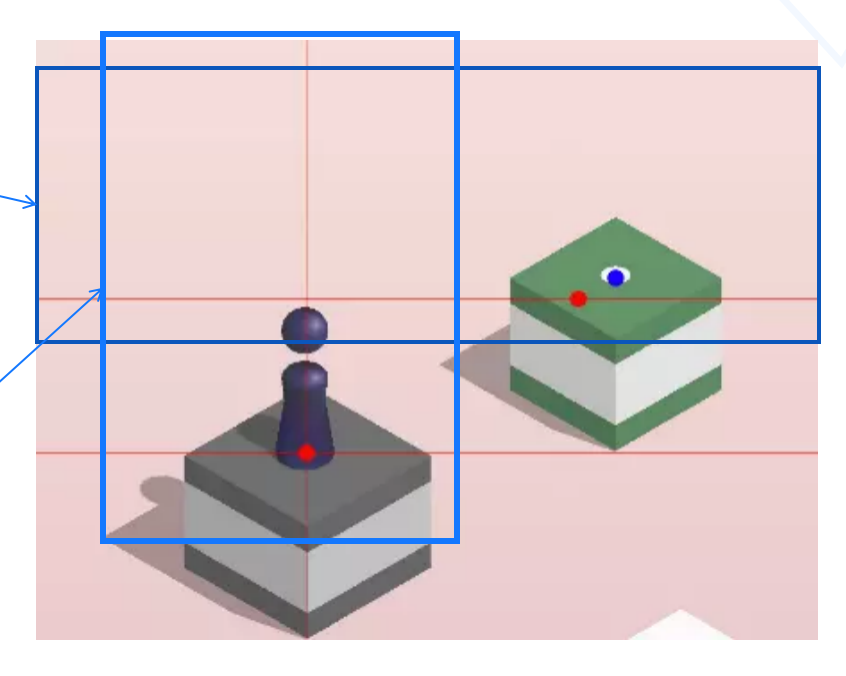

# 基于强化学习的跳一跳游戏机器人

由于我的组员，也是我的舍友，超级热爱Dota。我就萌生了要不就搞一下游戏AI的想法。但是经过了解，
DotaAI 或者王者荣誉的AI实在是太难了！！所以，我们选择了。。。。 做跳一跳游戏AI。

但是！！！！ **Dota AI是终极追求！！，下一步做其他游戏的AI。**

### 信息获取

1. 以50px为一步，自顶而下地扫描是否有“白色”这个目标点存在。
2. 以50px为一步，从左到右地扫描是否有“棋子”这个目标点存在。然后取最底部的值（X最小）。

### 分数获取

尽管算法很精准，但是，存在一个棋盘，导致检测关键点的位置有误差。所以，我们需要使用成熟的图像数字识别技术获取每一帧的分数

# 实现细节

为了快速收敛。

但是，我牺牲了DQN的优点，没有使用Fixed Q-target。因为在这个游戏里面，容忍忍受的误差范围太小，所以，我没有使用Fixed Q-target，让神经网络及时更新最新的参数和结果。

同时，我缩小了记忆库的范围，并没有让AI随机抽取学习，为了让它快速收敛，我取最前的几条记忆库的数据来学习。

还有，我调整了e-贪婪的参数，逐步增长的随机阈值为0.05，表示20轮之后会采用完全贪婪的方式来选取action。

# 后续工作

问额还有很多，希望各位志同道合的小伙伴跟我一起优化。

